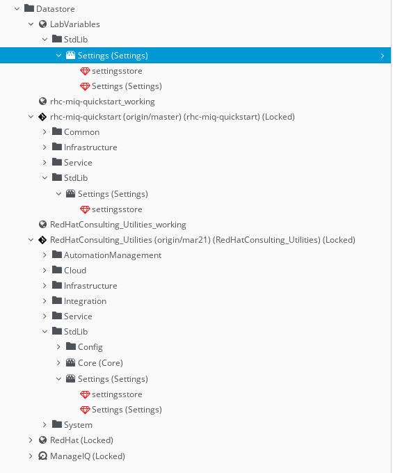

<<<<<<< HEAD
# RHPDS Testing & Evaluation Notes

RHPDS can be used to test and evaluate this. There is not a service with
this pre-installed place, obviously, but can be installed into one of services provided within a few minutes.

"Infrastructure Migration 1.1 GA" is suitable, as it contains 3 providers:
VMWare, RHV and OpenStack., "Migrating from VMware to Red Hat" may also be suitable (and
newer) for the same reason.

## Step by Step Setup
* Build a "Infrastructure Migration 1.1 GA" or "Migrating from VMware to Red Hat" service
* Do the basic install per the generic documentation
* Also import (from the command line) the automate domain in https://github.com/jeffwarnica/rhc-miq-quickstart_local, 
as a preconfigured starting point for local configuration.
* Give 'admin' a email address, and/or create additional users (with different tag filters).
* A ssh.cfg file on your real local workstation can be very helpful. Consider:
    ~~~~
    Host workstation-<uid>.rhpds.opentlc.com
      Hostname workstation-<uid>.rhpds.opentlc.com
      User jwarnica-redhat.com
      IdentityFile ~/.ssh/lab_key

    Host *rhpds.opentlc.com
        ProxyCommand ssh -W %h:%p jwarnica-redhat.com@workstation-<uid>.rhpds.opentlc.com -i ~/.ssh/csb_key

    ~~~~
    This allows you to SSH directly to hosts inside the lab, through the
    workstation, at the cost of the inside hosts no longer having SSH keys.

    SSH to the CF appliance with, e.g.
    `ssh -F ssh.cfg root@cf-e5e1.rhpds.opentlc.com` - first time with the lab password.
    Put your id_rsa.pub into /root/.ssh/authorized_keys for sanity.

* From CF UI:
  * Enable ' Git Repositories Owner' role.
  * Import GIT Automate repositories:
    * https://github.com/rhtconsulting/miq-Utilities.git
        * BLEEDING EDGE: https://github.com/jeffwarnica/miq-Utilities.git with some branch
    * https://github.com/jeffwarnica/rhc-miq-quickstart.git
  * If you plan on making any changes, my convention is to have matching xxx_working domains, just above in priority, to git
  backed things.
  * Create a "variables" domain, top priority
    * Copy in settings and settingsstore,
    * In settings, configure Embedded Methods, including settingsstore from
      miq-Utilities and rhc-miq-quickstart (including domain prefix!)
    * In settingsstore
      * update the top level "Module" to anyhting else ("Lab", say)
      * Change the priority from 0 to, say 100 and curse that you remember BASIC line numbers
  * Datstores might look like this:
    
  * Give "admin" and email address so he can provision stuff (email won't work anyway)
  * Import the Servie Dialogs and Service Catalogs from this project, with the command line tools:
    `[root@cf rhc-miq-quickstart]# miqimport service_dialogs service_dialogs/`
    `[root@cf rhc-miq-quickstart]# miqimport service_catalogs service_catalogs/`
  * Tag some things
    * Create a tag category name="os", Description="Operating System"
      * Create "linux" and "windows" Tags
    * Templates get OS tags
      * RHV and vSphere each have a RHEL template.
        OS=>Linux
        Prov Scope=>All
      * The default configuration is going to have dialogs that key on Env, so tag
        the RHV and vsphere templates to some env, say:
        Environment=>
           rhv->QA
           vmware->prod
  * Copy those templates with Windows-y names. per above, prov_scope, os, env
    This may involve logging into RHV or vSphere directly??
  * Tag RHV & vmware hosts as prov_scope=>all
  * Tag RHV & vmware datastores as prov_scope=>all (not Export or ISO)

# Provision some things!

Assuming neither of us screwed up writing or following the above, the SC items
"Generic VM From Env and OS" and "Generic VM From Template" should work. Or
produce nice log messages telling you in English what messed up.

## Things to note, play with, and test

### Template matching

### settings:
* list_template_guid_match_tags: see comment there
* template_match_methods: `align_tags` makes the most sense, but there is also `provider_location`    
  See detailed discussion in settingsstore and the actual code.

### build_vm_provision_request

Note the the VLAN lookup logic. If setting network_lookup_strategy: 'manualbytag',
using tags, build a new settings key, and lookup from that a literal value.

Maybe implement a new VlanHelper if there is complicated local logic and its worth the effort
to not juts hard code even a 100 entry list.

### Placement

The placement criteria and order are now configured in settingsstore.

infra_best_fit_with_scope has merged the RHV and VMWare logic. It doesnt
explode, but not tested under a loaded system; VMs do end up somewhere.